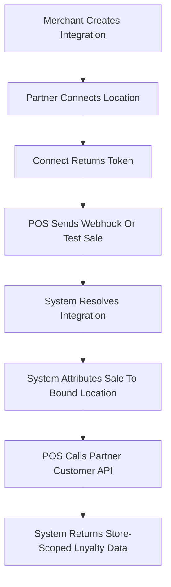

# POS Partner Handoff

This package is the shareable entry point for the POS connect, test-sale, customer lookup, and webhook integration with Samparka.

## Start Here

1. [Overview](./README)
2. [Quick Start](./quick-start)
3. [Endpoint Catalog](./endpoint-catalog)
4. [Payload Reference](./payload-reference)
5. [Testing Guide](./testing-guide)

## Integration Flow



## Connect Contract

Request:

```json
{
  "integrationKey": "{{integrationKey}}",
  "externalLocationId": "{{expectedLocationId}}",
  "externalLocationName": "{{expectedLocationName}}"
}
```

Success response:

```json
{
  "success": true,
  "integrationId": "{{integrationId}}",
  "token": "{{webhookToken}}",
  "status": "CONNECTED"
}
```

Validation:

- `integrationKey` is required.
- `externalLocationId` is required.
- `externalLocationName` is optional.

For backward compatibility, Samparka still accepts singular `restaurantId` and `restaurantName` fields, but new integrations should send the generic location fields.

## Test Sale Contract

`POST /api/partners/restrox/test-sale` wraps the underlying webhook response.

```json
{
  "success": true,
  "message": "Test sale submitted",
  "data": {
    "success": true,
    "message": "Event received"
  }
}
```

## Webhook Contract

Send webhook events to `/webhook/restrox/{token}` with transaction data and a customer phone:

```json
{
  "event_type": "order.completed",
  "order_id": "pos-sale-1001",
  "amount": 850,
  "customer": {
    "phone": "+97798XXXXXXXX"
  }
}
```

Payload location fields such as `external_location_id`, `external_location_name`, `restaurantId`, and `restaurantName` are optional non-canonical metadata for outlet-owned attribution.

## Customer Lookup Contract

Use the partner-authenticated customer lookup routes:

```http
GET /api/partners/restrox/customers/search?phone={{customerPhone}}
Authorization: Bearer {{providerApiKey}}
x-integration-key: {{integrationKey}}
```

```http
GET /api/partners/restrox/customers/{{customerId}}
Authorization: Bearer {{providerApiKey}}
x-integration-key: {{integrationKey}}
```

`providerApiKey` is shared manually by Samparka during onboarding. For this integration, use `restrox` as the route provider value. `x-integration-key` identifies the merchant or store context, and the search is scoped to that integration's store.

## Testing Checklist

Use [Integration Checklist](./integration-checklist) for go-live validation.

`ACTIVE` only proves the integration activated. Do not sign off until customer verification, loyalty transaction verification, and points verification are complete.

## OpenAPI

Use [openapi.yaml](./openapi.yaml) for machine-readable request and response definitions.

## Postman Collection

Use [postman-collection.json](./postman-collection.json) for hands-on testing.

## Support Contact

Use the Samparka support channel already assigned to your integration rollout.
