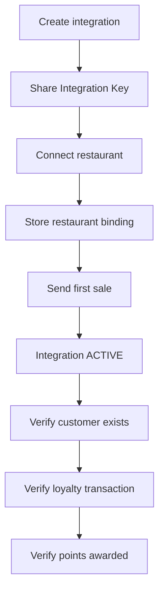

# RestroX Partner Handoff

```mermaid
flowchart TD
  A["Create integration"] --> B["Share Integration Key"]
  B --> C["Connect restaurant"]
  C --> D["Store restaurant binding"]
  D --> E["Send first sale"]
  E --> F["Integration ACTIVE"]
  F --> G["Verify customer exists"]
  G --> H["Verify loyalty transaction"]
  H --> I["Verify points awarded"]
```
