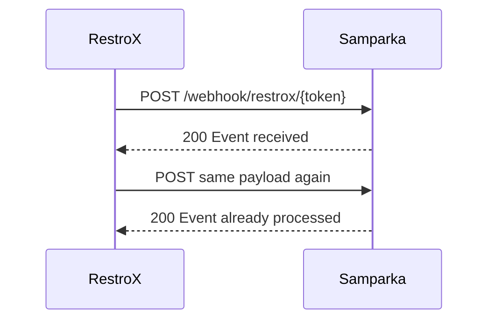

# Idempotency

Samparka accepts duplicate webhook deliveries safely. If RestroX sends the same webhook more than once, Samparka can return `200 Event already processed` instead of creating duplicate downstream activity.

Source:
samparka-backend/src/integrations/pos/controller.js:293-312
samparka-backend/src/loyalty/handlers/saleCompletedHandler.js:292-296
samparka-backend/src/loyalty/handlers/reversalEventHandler.js:158-160

## What RestroX Needs To Send

If a delivery times out or RestroX is unsure whether Samparka received the request, resend the same payload unchanged.

Source:
samparka-backend/src/integrations/pos/controller.js:293-312

## What Response To Expect

The first successful delivery normally returns:

```json
{
  "success": true,
  "message": "Event received"
}
```

A duplicate delivery can return:

```json
{
  "success": true,
  "message": "Event already processed"
}
```

Source:
samparka-backend/src/integrations/pos/controller.js:301-365

## What To Do If Something Goes Wrong

If RestroX retries a webhook and receives `Event already processed`, treat that as success and stop retrying that payload.



Source:
samparka-backend/src/integrations/pos/controller.js:293-312
