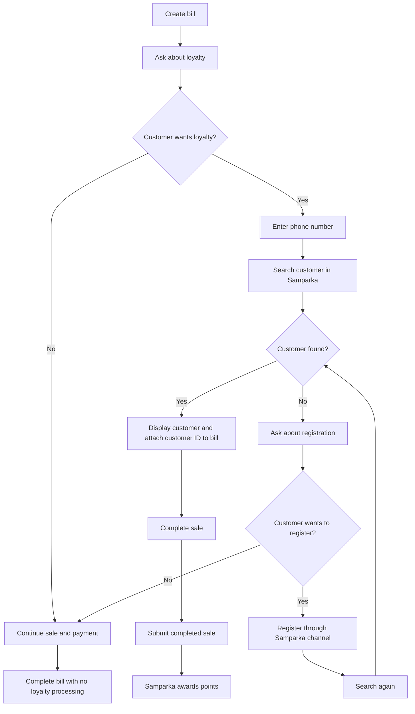
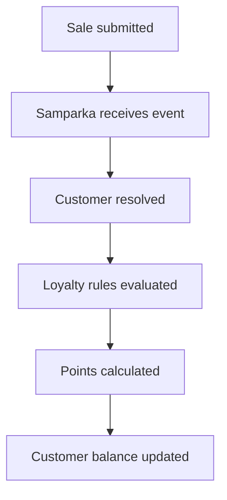

This page is the canonical workflow guide for loyalty awarding in the POS native integration.

It is written for:

- POS engineers
- product managers
- QA teams
- merchant onboarding teams

This page explains the intended cashier and merchant workflow. It is not an API reference page.

## Core Principles

### Loyalty Is Optional

A customer must never be forced to join Samparka.

If the customer does not want loyalty:

- the sale continues
- payment continues
- the bill completes normally

No business process should be blocked.

### Sales Are Never Blocked

If:

- the customer cannot be found
- the customer refuses registration
- Samparka search is unavailable
- loyalty processing is unavailable

the cashier must still complete the sale.

Loyalty is an enhancement, not a checkout requirement.

### Samparka Owns Loyalty Logic

POS must not calculate:

- points
- rewards
- tier upgrades
- tier downgrades
- campaign bonuses
- loyalty balances

POS identifies the customer, associates that identity to the sale, and submits the completed sale event.

Samparka calculates everything else.

The POS does not expose customer creation or update actions to cashiers.

Customer creation is not exposed through partner customer APIs.

Customer registration is managed by Samparka.

Loyalty processing may still resolve or create customer records internally according to Samparka identity rules.

## Recommended Cashier Workflow



### Step 1: Create Bill

The cashier creates the bill normally.

Example:

```text
Table 4
Total: NPR 2,500
```

### Step 2: Ask Customer About Loyalty

Example cashier prompts:

```text
Do you have Samparka?
```

or

```text
Would you like to earn loyalty points today?
```

### Step 3: Customer Decision

If the customer declines:

```text
Customer declines
-> Continue sale
-> Complete payment
-> No loyalty processing
```

No additional action is required.

If the customer wants loyalty, the cashier proceeds with customer lookup.

## Customer Lookup Flow

### Step 4: Enter Phone Number

The cashier enters the customer phone number.

Example:

```text
9801234567
```

POS performs customer search through the read-only partner customer API:

```http
GET /api/partners/{provider}/customers/search
```

### Step 5: Customer Lookup Result

#### Customer Found

Example response:

```json
{
  "exists": true,
  "customer": {
    "id": "687000000000000000000001",
    "name": "Ram Sharma",
    "phone": "9801234567",
    "points": 120,
    "tier": "Gold"
  }
}
```

POS should display:

- customer name
- current points
- tier, if available

Example UI:

```text
Ram Sharma
120 Points
Gold Tier
```

#### Customer Not Found

Example response:

```json
{
  "exists": false
}
```

The cashier should ask:

```text
Would you like to register with Samparka?
```

#### Invalid Or Conflicting Lookup

If the phone is invalid or identity conflict prevents a clean match, the cashier should not be blocked.

The sale still continues. Loyalty does not block checkout.

### Existing Customer Experience

```text
Customer Found
↓
Display Customer Name
Display Current Points
Display Tier (if configured)
↓
Associate Customer To Bill
↓
Complete Sale
```

After a successful lookup:

- the cashier should not manually enter or edit customer information
- the lookup result returned by Samparka is the source of truth
- POS should display the returned customer information as read-only

This keeps customer identity owned by Samparka and aligns with the read-only customer APIs.

## Customer Association Model

This is the key implementation rule for POS engineers:

```text
Search by phone
↓
Receive Samparka customer ID
↓
Attach customer ID to current bill
↓
Complete sale
↓
Submit sale
↓
Samparka performs loyalty processing
```

When a customer is found, POS should associate the returned Samparka customer ID with the in-progress bill or sale context.

The phone number is the lookup key. The Samparka customer ID is the identity POS should retain for the transaction when available.

This prevents each POS implementation from inventing its own identity flow.

## Registration Decision

### Customer Wants To Register

Customer registration happens through Samparka channels.

The POS does not create the customer directly.

After registration:

- the cashier searches again
- the customer is found
- loyalty can be associated to the bill

### Customer Declines Registration

```text
Customer declines registration
-> Continue sale
-> Complete payment
-> No loyalty processing
```

## Completing The Sale

Once the customer is identified and associated, the cashier completes payment normally.

POS then submits the completed sale using the associated customer identity.

Conceptual example:

```json
{
  "event_type": "sale.completed",
  "customer_id": "687000000000000000000001",
  "phone": "9801234567",
  "bill_number": "INV-1001",
  "amount": 2500
}
```

This example is conceptual only. Use the existing event and payload documentation for the supported transport contract.

### Customer Identity Persistence

Once a customer has been associated to the bill, the cashier should not be required to re-enter the phone number during checkout.

The selected customer should remain attached to the active bill until:

- the sale is completed
- the bill is cancelled
- the customer association is intentionally removed

This reduces cashier effort and lowers the risk of customer identification mistakes.

## Loyalty Processing



POS does not perform loyalty calculations.

POS must not calculate:

- points
- rewards
- tier upgrades
- tier downgrades
- bonuses
- balances

Loyalty processing may resolve or create customer records internally according to Samparka identity rules.

## Points And Tiers

### Points

Points are required.

Every merchant loyalty program awards points.

Points are configured in Samparka.

### Tiers

Tiers are optional.

A merchant may choose a points-only program:

```text
Points
No tiers
```

or a tier program:

```text
Bronze
Silver
Gold
```

or:

```text
VIP
Elite
Platinum
```

POS should treat:

```text
points = expected
tier = optional
```

If a tier exists, display it.

If a tier does not exist, do not show an error.

## Loyalty Unavailable Scenarios

### Customer Not Found

```text
Sale must continue.
Payment must complete.
Loyalty must never block checkout.
```

### Customer Declines Registration

```text
Sale must continue.
Payment must complete.
Loyalty must never block checkout.
```

### Samparka Search Unavailable

```text
Sale must continue.
Payment must complete.
Loyalty must never block checkout.
```

### Samparka Timeout

```text
Sale must continue.
Payment must complete.
Loyalty must never block checkout.
```

### Loyalty Processing Failure

If the sale has already been completed and submitted, any downstream loyalty failure is handled after checkout.

```text
Sale must continue.
Payment must complete.
Loyalty must never block checkout.
```

## POS Responsibilities

POS responsibilities:

- search customer
- display customer information
- associate customer identity with sale
- submit completed sale event

POS does not:

- expose customer creation actions to cashiers
- expose customer update actions to cashiers
- expose customer creation through partner customer APIs
- calculate points
- calculate rewards
- calculate tiers
- own loyalty balances or program logic

## Final Workflow Summary

```text
Create Bill
↓
Ask About Loyalty
↓
Enter Phone Number
↓
Search Customer

Found
 ↓
 Display Customer
 ↓
 Attach Customer ID To Bill
 ↓
 Complete Sale
 ↓
 Submit Sale Event
 ↓
 Samparka Awards Points

Not Found
 ↓
 Ask About Registration

Register
 ↓
 Search Again
 ↓
 Found
 ↓
 Attach Customer ID To Bill
 ↓
 Complete Sale

Decline
 ↓
 Complete Sale
 ↓
 No Loyalty
```

## Related Documentation

- [Customer Identity](./customer-identity)
- [Customer API](./customer-api)
- [Loyalty Processing](./loyalty-processing)
- [Payload Reference](../payload-reference)
