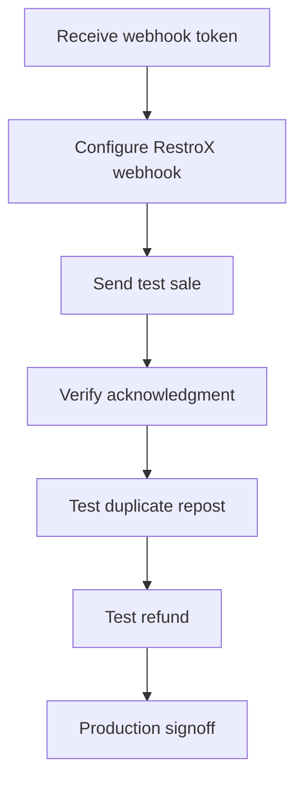

This package is the shareable entry point for RestroX webhook integration with Samparka. Samparka accepts sale, refund, and void webhook events so restaurants can connect RestroX transactions to loyalty processing. The backend exposes a token-based webhook URL, expects JSON payloads, and returns a simple acknowledgment response. Integration effort is low if your team already sends webhook events from RestroX.

## Start Here

1. [Overview](./README)
2. [Quick Start](./quick-start)
3. [Webhook Endpoint](./webhook-endpoint)
4. [Payload Reference](./payload-reference)
5. [Testing Guide](./testing-guide)

## Integration Flow

## Supported Events

- `order.completed`
- `refund.created`
- `order.voided`

## Testing Checklist

Use [Integration Checklist](./integration-checklist) for go-live validation.

## OpenAPI

Use [openapi.yaml](./openapi.yaml) for machine-readable request and response definitions.

## Postman Collection

Use [postman-collection.json](./postman-collection.json) for hands-on testing.

## Support Contact

Implementation Detail Requires Confirmation
