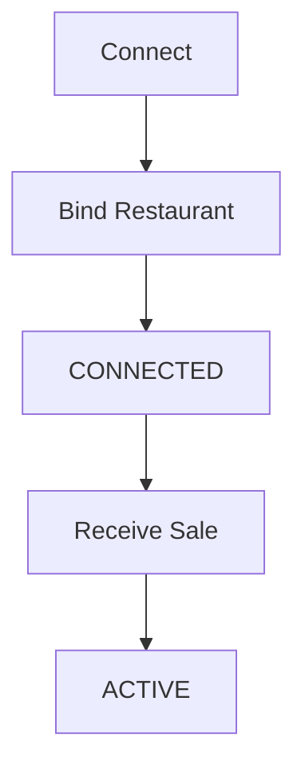

# RestroX Partner Handoff

This package is the shareable entry point for the RestroX connect and webhook integration with Samparka. Connect uses a singular restaurant-binding contract. There is no location sync, location review, or location selection step in the active RestroX connect path.

Source:
samparka-backend/src/index.js:146-155
samparka-backend/src/integrations/pos/partners/restrox/controller.js:7-28
samparka-backend/src/integrations/pos/partners/restrox/service.js:132-260
samparka-backend/src/integrations/pos/routes.js:11-15

## Start Here

1. [Overview](./README)
2. [Quick Start](./quick-start)
3. [Endpoint Catalog](./endpoint-catalog)
4. [Payload Reference](./payload-reference)
5. [Testing Guide](./testing-guide)

## Integration Flow



Source:
samparka-backend/src/integrations/pos/partners/restrox/service.js:132-260
samparka-backend/src/integrations/pos/controller.js:285-365

## Connect Contract

```json
{
  "integrationKey": "{{integrationKey}}",
  "restaurantId": "{{expectedRestaurantId}}",
  "restaurantName": "{{expectedRestaurantName}}"
}
```

Validation:

- `integrationKey` is required.
- `restaurantId` is required.
- `restaurantName` is optional.
- The request fails with `400` if `restaurantId` is missing.

Source:
samparka-backend/src/integrations/pos/partners/restrox/controller.js:9-28
samparka-backend/src/integrations/pos/partners/restrox/service.js:132-260

## Testing Checklist

Use [Integration Checklist](./integration-checklist) for go-live validation.

## OpenAPI

Use [openapi.yaml](./openapi.yaml) for machine-readable request and response definitions.

## Postman Collection

Use [postman-collection.json](./postman-collection.json) for hands-on testing.

## Support Contact

Use the Samparka support channel already assigned to your integration rollout.
