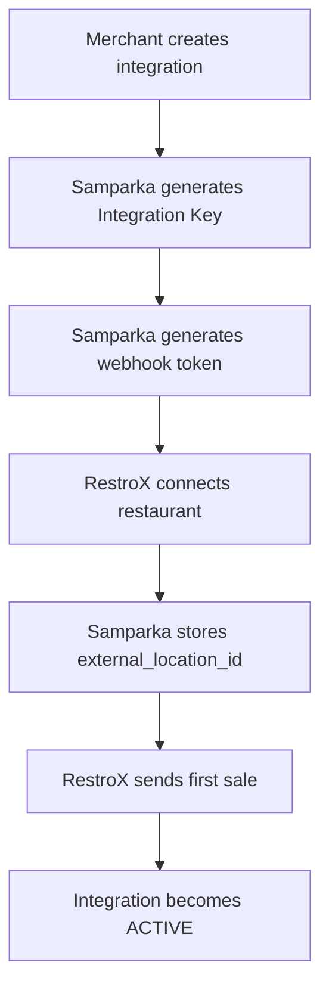

# RestroX Partner Handoff

RestroX is an outlet-owned integration. The onboarding sequence is:

## What To Share

- outlet-specific Integration Key
- outlet-specific webhook URL
- expected restaurant identifier for that outlet

## What To Avoid

- do not plan a migration flow
- do not create a second RestroX integration for the same outlet
- do not use store-owned setup assumptions for RestroX
