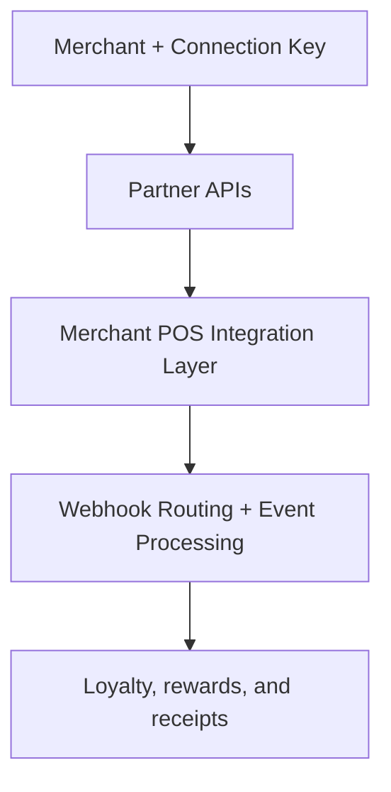

# RestroX Partner Guide

Samparka supports RestroX through a native integration flow for merchant onboarding, location sync, and customer operations. The native flow sits above Samparka's existing webhook processing engine, which continues to handle sale, refund, and void events.

## Integration Flow

1. Merchant creates a RestroX integration in Samparka.
2. Merchant shares the Samparka Connection Key with RestroX.
3. RestroX connects the merchant through the partner API.
4. RestroX syncs locations.
5. RestroX verifies customer behavior through partner customer APIs.
6. RestroX sends a test sale.
7. Samparka marks the integration ready when onboarding checks are satisfied.

## Architecture Note

The native integration is an onboarding and partner API layer. It does not replace the underlying webhook engine.

## Quick Links

- [Native Overview](./native/overview)
- [Architecture](./native/architecture)
- [Environments](./native/environments)
- [Native Authentication](./native/authentication)
- [Connection Keys](./native/connection-keys)
- [Merchant Onboarding](./native/merchant-onboarding)
- [Customer Identity](./native/customer-identity)
- [Customer API](./native/customer-api)
- [Partner API](./native/partner-api)
- [Store Linking](./native/store-linking)
- [Loyalty Processing](./native/loyalty-processing)
- [Webhook Endpoint](./webhook-endpoint)
- [Payload Reference](./payload-reference)
- [Testing Guide](./testing-guide)
- [Readiness Checklist](./native/readiness-checklist)

## Important Integration Note

A successful native onboarding flow does not bypass webhook processing. Event delivery still uses the existing RestroX event pipeline, and a `200 Event received` response means Samparka accepted the delivery. It does not guarantee that loyalty activity was created.
