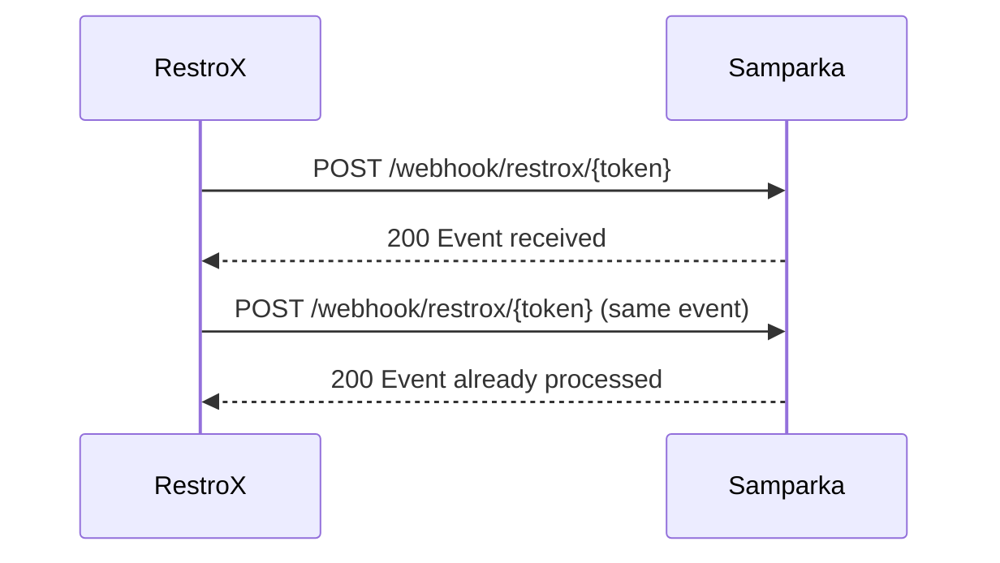

Samparka accepts duplicate RestroX webhook deliveries safely.

## Behavior

- duplicates return `200 Event already processed`
- idempotency is scoped to the integration
- sale and refund events with the same order identifier are treated as different event types
