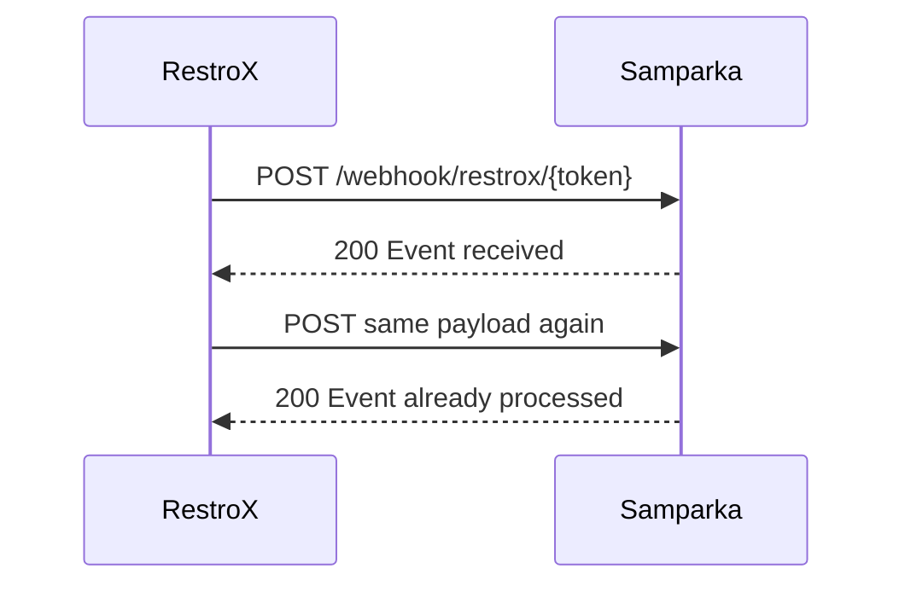

Samparka accepts duplicate webhook deliveries safely. If RestroX sends the same webhook more than once, Samparka can return `200 Event already processed` instead of creating duplicate downstream activity.

## What RestroX Needs To Send

If a delivery times out or RestroX is unsure whether Samparka received the request, resend the same payload unchanged.

## What Response To Expect

The first successful delivery normally returns:

```json
{
  "success": true,
  "message": "Event received"
}
```

A duplicate delivery can return:

```json
{
  "success": true,
  "message": "Event already processed"
}
```

## Idempotency Behavior

Duplicate submissions are acknowledged successfully but are not reprocessed. No loyalty award is attempted on a duplicate event.

### Key Construction

The idempotency key is computed as `{event_type}:{order_id}`. Both the event type and the transaction identifier together determine uniqueness. This means:

- A sale and a refund for the same `order_id` are **not** duplicates — they have different `event_type` prefixes and are processed independently.
- Resending the exact same sale payload with the same `event_type` and `order_id` **is** a duplicate and returns `Event already processed`.

If no `order_id`, `transaction_id`, or `id` is present, Samparka computes a deterministic SHA-256 fallback key from the provider, event type, amount, and timestamp. Retry safety in that case depends on resending exactly the same payload values.

### Scope

Idempotency is scoped per integration. The same `order_id` value used by two different merchant integrations does not cause a conflict.

## What To Do If Something Goes Wrong

If RestroX retries a webhook and receives `Event already processed`, treat that as success and stop retrying that payload.


