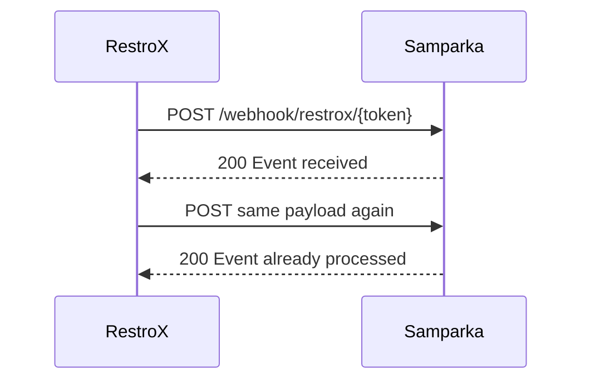

Samparka accepts duplicate webhook deliveries safely. If RestroX sends the same webhook more than once, Samparka can return `200 Event already processed` instead of creating duplicate downstream activity.

## What RestroX Needs To Send

If a delivery times out or RestroX is unsure whether Samparka received the request, resend the same payload unchanged.

## What Response To Expect

The first successful delivery normally returns:

```json
{
  "success": true,
  "message": "Event received"
}
```

A duplicate delivery can return:

```json
{
  "success": true,
  "message": "Event already processed"
}
```

## Idempotency Behavior

Duplicate submissions are acknowledged successfully but are not reprocessed. No loyalty award is attempted on a duplicate event. The transaction ID is used for duplicate detection — submitting the same `order_id`, `transaction_id`, or `id` a second time will return `Event already processed`.

## What To Do If Something Goes Wrong

If RestroX retries a webhook and receives `Event already processed`, treat that as success and stop retrying that payload.


