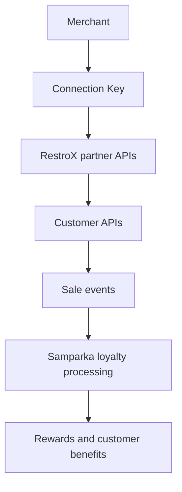
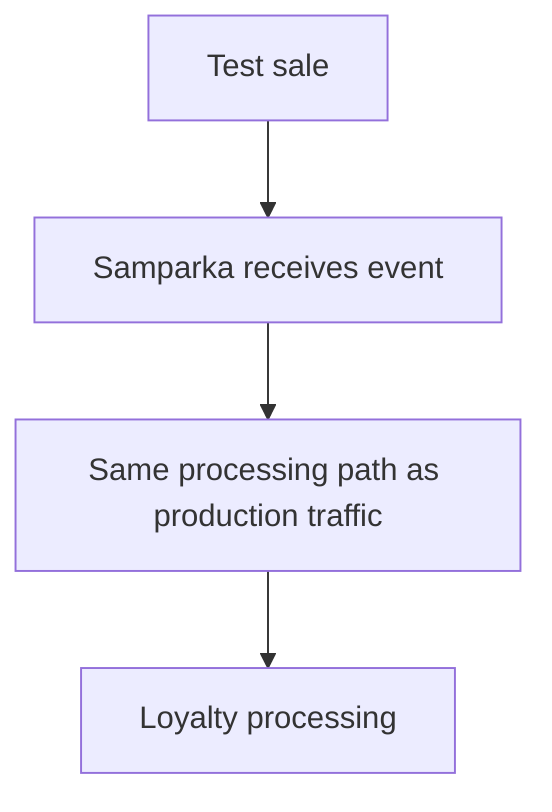

# Architecture

The RestroX native integration connects RestroX to Samparka through onboarding APIs, customer lookup APIs, and sale-event submission.

This page focuses on how the systems and public interfaces fit together. For cashier workflow and loyalty participation behavior, use the dedicated workflow pages.

## Purpose

Use this page to understand:

- which APIs RestroX calls directly
- where Connection Keys fit
- how onboarding, customer lookup, and sale events fit together
- how customer identity relates to loyalty participation

## System Flow

## Event Processing Path

`test-sale` validates integration behavior before go-live.

Production webhooks follow the same downstream loyalty processing behavior after Samparka receives the event.

Partners should expect consistent loyalty outcomes between testing and production when the input conditions are the same.

## External Partner Touchpoints

RestroX uses these public partner-facing surfaces:

- Connection Key handoff
- `POST /api/partners/restrox/connect`
- `POST /api/partners/restrox/sync-locations`
- `POST /api/partners/restrox/test-sale`
- `GET /api/partners/{provider}/customers/search`
- `GET /api/partners/{provider}/customers/{customerId}`
- `POST /webhook/restrox/{token}`

## Internal Processing Boundaries

Samparka performs internal validation, routing, loyalty evaluation, and reward processing after receiving events. These internal services are not partner-facing APIs and may change without affecting the public integration contract.

## Customer Identity In The Flow

Customer identity is store-scoped and phone-first.

- partner customer APIs search and retrieve customers using normalized phone identity
- webhook sale events may still be accepted even when loyalty cannot be awarded immediately
- customer identity affects loyalty participation and customer association

See [Customer Identity](./customer-identity) for the exact outcomes used by the implementation.

## Credential Roles

| Credential | Purpose |
| ------ | ------- |
| Partner Key | Authenticate native partner APIs and partner customer APIs |
| Integration Key | Resolve the merchant integration for connect, sync-locations, and test-sale |
| Webhook Token | Route canonical webhook traffic to the mapped location |
| `api_key` | Authenticate the legacy provider event route only |

## Operational Notes

- The native partner `test-sale` API and production webhook traffic follow the same downstream processing behavior.
- Native onboarding and customer preparation influence loyalty outcomes.
- The legacy provider route still exists, but it is not part of native onboarding, customer APIs, connect, sync-locations, or test-sale.
- Location sync can place an integration into a review-required state before any live traffic is sent.

## Troubleshooting Notes

- If a merchant appears connected but is not ready, check the native onboarding state before investigating event delivery.
- If locations were synced but not auto-matched, the integration can require review before testing.
- If a sale is accepted but loyalty is missing, review location readiness, customer identity, and loyalty participation assumptions.

## Related Documentation

- [Customer Loyalty Award Flow](./customer-loyalty-award-flow)
- [Loyalty Processing](./loyalty-processing)
- [Customer Identity](./customer-identity)
- [Partner API](./partner-api)
- [Store Linking](./store-linking)
- [Webhook Endpoint](../webhook-endpoint)
