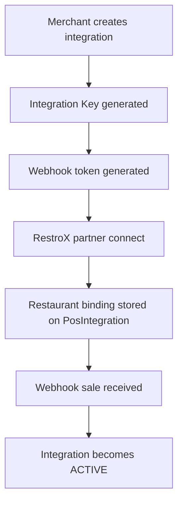

RestroX uses one outlet-owned integration record per outlet.

## System Flow



## Public RestroX Surfaces

- `POST /api/pos-integrations`
- `GET /api/pos-integrations/{id}`
- `PATCH /api/pos-integrations/{id}`
- `DELETE /api/pos-integrations/{id}`
- `GET /api/pos-integrations/{id}/status`
- `POST /api/partners/restrox/connect`
- `POST /api/partners/restrox/sync-locations`
- `POST /api/partners/restrox/test-sale`
- `GET /api/partners/{provider}/customers/search`
- `GET /api/partners/{provider}/customers/{customerId}`
- `POST /webhook/restrox/{token}`

## Ownership Model

One outlet owns:

```text
1 outlet
-> 1 RestroX integration
-> 1 integration key
-> 1 webhook token
-> 1 restaurant binding
```

## Routing Model

For outlet-owned RestroX, the webhook token resolves directly to `PosIntegration.webhook_token`.

The token identifies:

- provider `restrox`
- one outlet-owned integration
- one outlet
- one bound restaurant

## Activation Rule

When the integration is already `CONNECTED`, the first valid `sale.completed` webhook changes the integration status to `ACTIVE` and resets health to `HEALTHY`.
