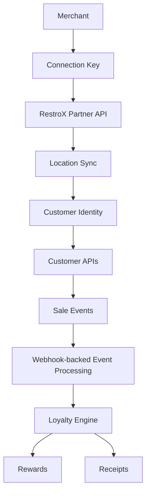
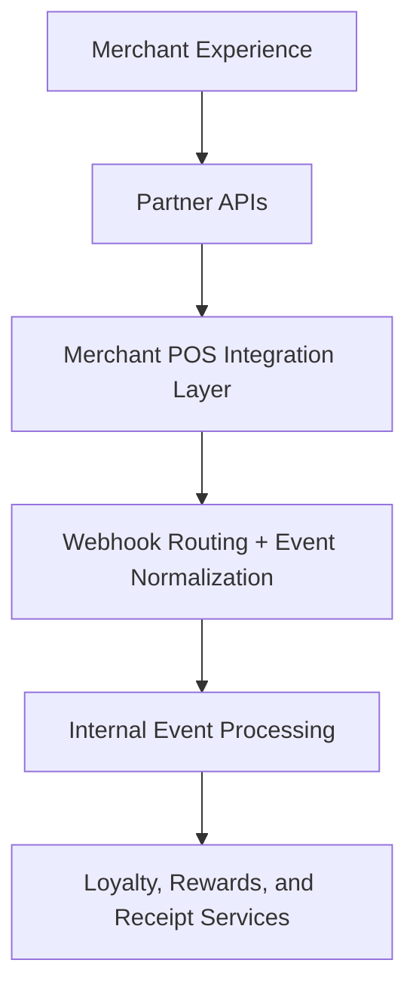

# Architecture

The RestroX native integration is not a separate transaction-processing engine. It is a partner-facing onboarding and customer layer that feeds Samparka's existing POS event pipeline.

## Purpose

Use this page to understand:

- which APIs RestroX calls directly
- where Connection Keys fit
- how customer identity affects downstream loyalty outcomes
- how native onboarding and webhook delivery work together

## System Flow

## Architecture Layers

## External Partner Touchpoints

RestroX uses these public partner-facing surfaces:

- Connection Key handoff
- `POST /api/partners/restrox/connect`
- `POST /api/partners/restrox/sync-locations`
- `POST /api/partners/restrox/test-sale`
- `GET /api/partners/{provider}/customers/search`
- `POST /api/partners/{provider}/customers`
- `POST /api/partners/{provider}/customers/upsert`
- `GET /api/partners/{provider}/customers/{customerId}`
- `PATCH /api/partners/{provider}/customers/{customerId}`
- `POST /webhook/restrox/{token}`

## Internal Processing Boundaries

The following are implementation layers, not separate partner-managed systems:

- merchant POS integration status calculation
- location activation checks
- raw webhook event storage
- internal event creation
- loyalty ledger updates
- receipt-linked points bookkeeping

These internal layers explain behavior that partners can observe, but they are not documented as public APIs.

## Customer Identity In The Flow

Customer identity is store-scoped and phone-first.

- partner customer APIs resolve and create customers using normalized phone identity
- webhook sale events may still be accepted even when loyalty cannot be awarded immediately
- customer identity outcomes affect whether a sale can be matched cleanly downstream

See [Customer Identity](./customer-identity) for the exact outcomes used by the implementation.

## Operational Notes

- The native integration still depends on per-location webhook tokens internally.
- The native partner `test-sale` API does not bypass the event engine. It forwards the payload into the existing provider event route.
- Location sync can place an integration into a review-required state before any live traffic is sent.

## Troubleshooting Notes

- If a merchant appears connected but is not ready, check the native onboarding state before investigating webhook payloads.
- If locations were synced but not auto-matched, the integration can require review before testing.
- If a sale is accepted but loyalty is missing, the issue may be location resolution, customer identity, or loyalty eligibility rather than transport failure.

## Related Documentation

- [Native Overview](./overview)
- [Merchant Onboarding](./merchant-onboarding)
- [Store Linking](./store-linking)
- [Customer Identity](./customer-identity)
- [Partner API](./partner-api)
- [Webhook Endpoint](../webhook-endpoint)
