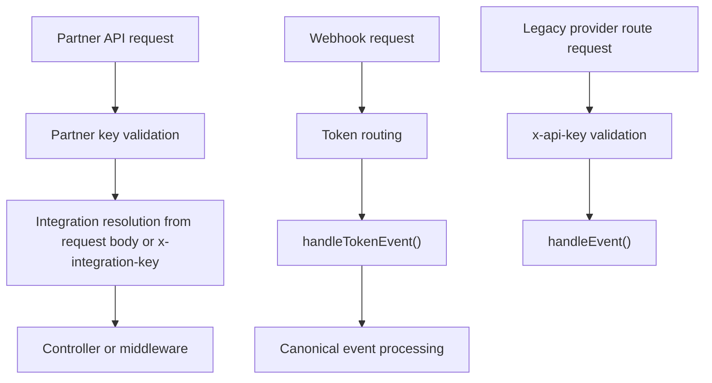

# Native Authentication

The RestroX integration uses more than one authentication mechanism. The correct credential depends on the API surface you are calling.

## Purpose

Use this page to understand:

- which credential belongs to each route family
- which headers are required
- how native partner APIs differ from canonical webhook routing

## Authentication Matrix

| Credential | Purpose | Where It Is Used Today |
| ------ | ------- | ---------------------- |
| Partner Key | Authenticate partner-managed APIs | `POST /api/partners/restrox/connect`, `POST /api/partners/restrox/sync-locations`, `POST /api/partners/restrox/test-sale`, and partner customer APIs |
| Integration Key | Resolve the merchant integration | request body for connect, sync-locations, and test-sale; `x-integration-key` for partner customer APIs |
| Webhook Token | Route canonical webhook traffic to a mapped location | `POST /webhook/restrox/{token}` and internal token routing used by native `test-sale` |
| `api_key` | Authenticate the legacy provider event route | `POST /integrations/pos/{provider}/events` only |

## Authentication Types

### Partner API Authentication

Used by:

- `POST /api/partners/restrox/connect`
- `POST /api/partners/restrox/sync-locations`
- `POST /api/partners/restrox/test-sale`

Accepted credentials:

- `x-partner-key`
- `Authorization: Bearer {partnerKey}`

These routes also require `integrationKey` in the request body so the integration can be resolved.

### Partner Customer Authentication

Used by:

- `GET /api/partners/{provider}/customers/search`
- `GET /api/partners/{provider}/customers/{customerId}`

Required credentials:

- partner key through `x-partner-key` or `Authorization: Bearer ...`
- merchant Connection Key through `x-integration-key`

The current middleware rejects:

- missing integration key
- invalid integration key
- inactive integrations

### Webhook Authentication

Used by:

- `POST /webhook/restrox/{token}`

Required credential:

- webhook token in the URL path

### Legacy Provider Event Authentication

Used by:

- `POST /integrations/pos/{provider}/events`

Required credential:

- `x-api-key`

This route still exists in the current implementation, but it is not part of native onboarding, partner customer APIs, connect, sync-locations, or test-sale.

### Merchant API Authentication

Used by merchant POS integration routes such as:

- `/api/pos-integrations/*`

These routes use existing Samparka merchant, store, or admin authentication middleware and are not public partner APIs.

## Required Headers

### Partner API Example

```http
POST /api/partners/restrox/connect
Content-Type: application/json
x-partner-key: your-partner-key
```

### Partner Customer API Example

```http
GET /api/partners/restrox/customers/search?phone=9801234567
x-partner-key: your-partner-key
x-integration-key: SPK-RX-ABC12345
```

### Bearer Token Example

```http
Authorization: Bearer your-partner-key
```

### Webhook Example

```http
POST /webhook/restrox/{token}
Content-Type: application/json
```

### Legacy Provider Event Example

```http
POST /integrations/pos/restrox/events
Content-Type: application/json
x-api-key: integration-api-key
```

## Workflow



## Production Authentication

The verified implementation reads partner credentials from:

- `RESTROX_PARTNER_API_KEY`
- `POS_PARTNER_API_KEY`

Implementation detail requires clarification.

The current docs package does not publish a formal production credential issuance process.

## Staging Authentication

Implementation detail requires clarification.

No staging-specific partner key issuance flow was verified in the current code pass.

## Authorization Failures

### Partner API Not Configured

```json
{
  "success": false,
  "message": "RestroX partner API is not configured"
}
```

### Unauthorized Partner Request

```json
{
  "success": false,
  "message": "Unauthorized partner request"
}
```

### Missing Integration Key

```json
{
  "error": "partner_customer_error",
  "message": "Missing integration key"
}
```

### Invalid Integration Key

```json
{
  "error": "partner_customer_error",
  "message": "Invalid integration key"
}
```

### Integration Inactive

```json
{
  "error": "partner_customer_error",
  "message": "Integration is inactive"
}
```

### Invalid Webhook Token

```json
{
  "success": false,
  "message": "Invalid webhook token"
}
```

## Credential Rotation

Verified rotation behavior:

- Connection Keys can be rotated through the merchant integration route
- webhook tokens can be regenerated per location

Implementation detail requires clarification.

No verified public partner-key rotation route is published in the current implementation.

## Operational Notes

- Partner APIs accept either `x-partner-key` or bearer token format.
- Partner customer APIs are protected by both partner authentication and integration-key resolution.
- The native RestroX integration no longer uses `api_key` for partner authentication or test-sale execution.

## Troubleshooting Notes

- If partner APIs fail with `Unauthorized partner request`, confirm the partner key before checking payloads.
- If partner customer APIs fail with `Missing integration key`, confirm the `x-integration-key` header is present.
- If webhook delivery fails with `Invalid webhook token`, confirm you are using the per-location token rather than the merchant Connection Key.

## Related Documentation

- [Connection Keys](./connection-keys)
- [Partner API](./partner-api)
- [Customer API](./customer-api)
- [Webhook Endpoint](../webhook-endpoint)
