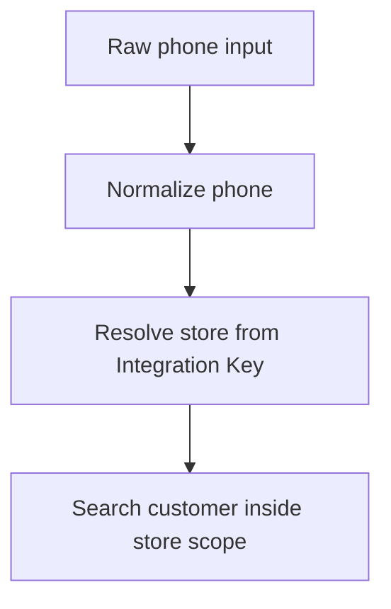

RestroX customer lookup is store-scoped and phone-first.

## Current Behavior

- customer APIs are read-only
- searches are exact phone lookups
- the Integration Key resolves the merchant store
- the same phone can exist in different stores without conflict

## Phone Normalization

For RestroX payloads and customer lookups, phone numbers without a country prefix default to Nepal (`NP`).

