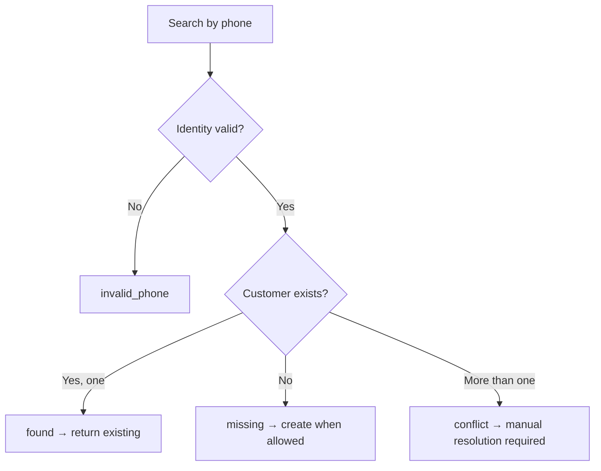

# Customer Identity

The RestroX native integration uses store-scoped, phone-first customer identity. Partner customer operations resolve, create, and return customers through normalized phone behavior.

## Purpose

Use this page to understand:

- how phone numbers are normalized
- how Samparka resolves customers within a store
- what happens when conflicts or invalid phone inputs appear

## Identity Architecture

Customer identity is scoped to a single Samparka store.

- the same phone can exist in different stores
- customer lookup is not global across all businesses
- normalized phone identity is the primary partner-facing lookup key

## Normalized Phone Strategy

The backend builds multiple normalized phone representations and stores a normalized local identity when possible.

Examples:

```text
9801234567
9779801234567
+9779801234567
```

all normalize to:

```text
9801234567
```

Implementation note:

- the service tries to derive local and E.164 variants
- lookup checks `normalized_phone` first and also checks stored `phone` variants

## Customer Resolution

Verified partner-facing outcomes:

- `found`
- `missing`
- `created`
- `conflict`
- `invalid_phone`

These outcomes come from the identity and customer service logic, even when not every endpoint serializes the outcome using the same explicit field name.

## Customer Lifecycle



## Create Or Return Existing

Partner customer create and upsert flows both prevent duplicate creation by:

- normalizing the phone
- checking for existing customers in the same store
- returning the existing customer when one match exists
- rejecting with conflict when more than one match exists

## Conflict Detection

A conflict occurs when multiple customer records share the same normalized phone inside one store.

Current partner-facing conflict behavior:

```json
{
  "error": "customer_identity_conflict",
  "message": "Multiple customer records share the same normalized phone. Admin resolution is required."
}
```

## Collision Handling

The verified implementation does not publish a partner-facing merge or conflict-resolution API.

When conflict exists:

- search fails with conflict
- create fails with conflict
- upsert fails with conflict
- manual resolution is required before automated partner identity operations can continue

## Identity Guarantees

The verified data model enforces store-scoped uniqueness for:

- `phone`
- `normalized_phone` when present

This gives the partner API a deterministic identity guarantee when the store has zero or one matching customer for a normalized phone.

## Endpoints Affected

Customer identity affects:

- `GET /api/partners/{provider}/customers/search`
- `POST /api/partners/{provider}/customers`
- `POST /api/partners/{provider}/customers/upsert`
- downstream sale-event loyalty resolution

## Examples

### Search Finds Existing Customer

```json
{
  "exists": true,
  "customer": {
    "id": "687000000000000000000001",
    "name": "Asha",
    "phone": "9801234567",
    "email": "asha@example.com",
    "points": 45,
    "tier": "Bronze Tier",
    "lifetimePoints": 45,
    "membershipSince": "2026-06-08T10:15:00.000Z"
  }
}
```

### Search Does Not Find Customer

```json
{
  "exists": false
}
```

### Invalid Phone

```json
{
  "error": "partner_customer_error",
  "message": "Invalid phone number"
}
```

### Conflict

```json
{
  "error": "customer_identity_conflict",
  "message": "Multiple customer records share the same normalized phone. Admin resolution is required."
}
```

## Operational Notes

- Partner update does not allow phone changes.
- Customer create and upsert mark new records with `customer_source = "pos"` and provider metadata for RestroX.
- Registration-side effects can still apply when a new partner-created customer is registered through the shared customer registration service.

## Troubleshooting Notes

- If search fails with `Invalid phone number`, normalize and validate the phone before retrying.
- If create unexpectedly returns an existing customer, the normalized phone already belongs to one customer in that store.
- If partner flows stop on conflict, manual cleanup is required before continuing automated sync behavior.

## Related Documentation

- [Customer API](./customer-api)
- [Partner API](./partner-api)
- [Loyalty Processing](./loyalty-processing)
