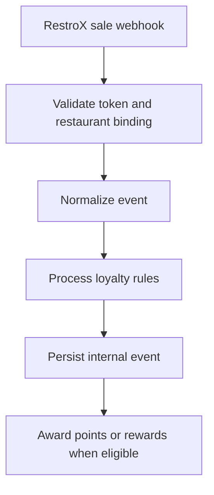

RestroX does not calculate loyalty. Samparka processes the normalized event after webhook validation succeeds.

## Award Flow

## Activation Side Effect

If the integration is currently `CONNECTED`, the first valid `sale.completed` event also promotes the integration to `ACTIVE`.
