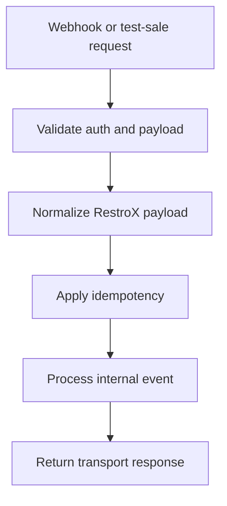

RestroX submits sales, refunds, and voids. Samparka handles routing, normalization, idempotency, and loyalty processing.

## Important Outcomes

- duplicate events return `200 Event already processed`
- a valid webhook can still fail with `409` when the integration is disconnected or the restaurant binding does not match
- test-sale uses the same webhook processing pipeline after the service injects the stored restaurant binding
