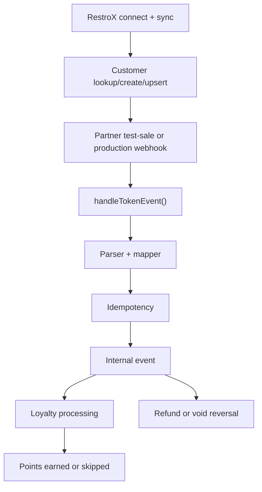

# Loyalty Processing

The RestroX native integration does not award loyalty points directly through the partner API. It feeds Samparka's canonical token-routed event ingress, which then continues through internal event processing and the loyalty engine.

## Purpose

Use this page to understand:

- how native onboarding and customer identity feed event processing
- what happens after a sale event is submitted
- where customer identity outcomes affect loyalty expectations

## Workflow



## Concepts

The current event engine processes:

- `order.completed`
- `refund.created`
- `order.voided`

The sale path awards loyalty points when the event can be processed successfully.

The refund and void paths reverse earlier earned activity when the original sale can be matched.

## Customer Identity Outcomes

Customer identity still matters even though the native test-sale path focuses on event submission.

Relevant outcomes:

- `found`
- `missing`
- `created`
- `conflict`
- `invalid_phone`

Practical effect:

- `found`: the customer already exists and can receive loyalty normally if the event is otherwise eligible
- `missing`: the event may still be accepted, but downstream loyalty expectations can differ if the customer was not prepared in advance
- `created`: a new customer is available for subsequent partner flows
- `conflict`: manual resolution is required before clean identity-based automation can continue
- `invalid_phone`: customer preparation must be corrected before reliable identity-based workflows can proceed

Implementation detail requires clarification.

The current public responses confirm delivery acceptance, not a separate public loyalty outcome.

## Endpoints Involved

### Native Test Sale

```http
POST /api/partners/restrox/test-sale
```

### Canonical Webhook Route

```http
POST /webhook/restrox/{token}
```

### Existing Legacy Provider Route

```http
POST /integrations/pos/{provider}/events
```

The legacy provider route still exists, but native `test-sale` does not use it.

## Response Expectations

Accepted transport response:

```json
{
  "success": true,
  "message": "Event received"
}
```

Duplicate-safe response:

```json
{
  "success": true,
  "message": "Event already processed"
}
```

## Failure Scenarios

### Event Accepted, Loyalty Not Visible

Possible reasons already reflected in the current code path:

- location mapping needs review
- location participation is disabled
- location mapping is inactive or stale
- customer input needs review
- refund linkage needs review

### Duplicate Replay

The ingress acknowledges duplicate deliveries safely and does not treat the same event as a new sale.

### Refund Or Void Cannot Be Matched

Refund and reversal logic depend on being able to match the original sale activity.

## Operational Notes

- Partner `test-sale` and production webhook traffic share the same downstream loyalty path after `handleTokenEvent()`.
- The native integration changes onboarding and customer preparation, not the underlying transaction engine.
- Refund verification remains recommended even though it is optional in the current merchant readiness checklist.

## Troubleshooting Notes

- If customer search and upsert are working but loyalty is still missing, inspect location state and event validation next.
- If a refund event is accepted but reversal is not visible, confirm the original sale identifier is consistent.
- If repeated test sales return duplicate acknowledgment, confirm you are changing the event identifier for a new test.

## Related Documentation

- [Customer Identity](./customer-identity)
- [Customer API](./customer-api)
- [Partner API](./partner-api)
- [Webhook Endpoint](../webhook-endpoint)
- [Refunds](../refunds)
- [Idempotency](../idempotency)
