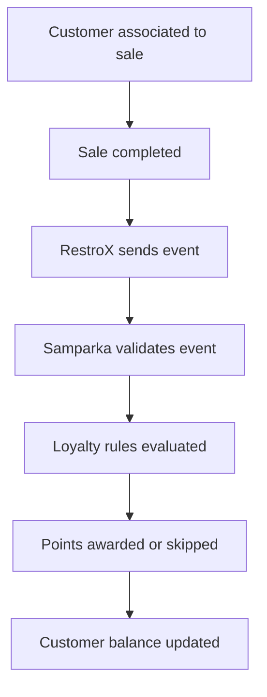

RestroX submits sale and related events. Samparka then processes loyalty after receiving those events.

Loyalty calculation is owned by Samparka. RestroX does not calculate points, rewards, tiers, or balances.

## Purpose

Use this page to understand:

- what happens after a sale event is submitted
- which event types affect loyalty
- what responses partners should expect
- how duplicate events are handled
- what partners should troubleshoot

For the cashier-facing and bill-association workflow, use [Customer Loyalty Award Flow](./customer-loyalty-award-flow).

## Workflow



## Event Types

The loyalty flow is affected by these partner-facing event types:

- `order.completed`
- `refund.created`
- `order.voided`

### `order.completed`

Eligible loyalty activity may earn points.

### `refund.created`

Previously awarded activity may be reversed.

### `order.voided`

Previously awarded activity may be reversed.

## Customer Identity Considerations

Customer identity affects loyalty eligibility.

### Found

Customer is identified successfully and can participate in loyalty.

### Not Found

The sale may continue normally, but loyalty participation depends on merchant workflow.

### Conflict

Customer information requires review before reliable customer identification can occur.

### Invalid Phone

Customer lookup information should be corrected before loyalty participation can be verified.

## Endpoints Involved

### Native Test Sale

```http
POST /api/partners/restrox/test-sale
```

### Canonical Webhook Route

```http
POST /webhook/restrox/{token}
```

## Response Expectations

Accepted transport response:

```json
{
  "success": true,
  "message": "Event received"
}
```

Duplicate-safe response:

```json
{
  "success": true,
  "message": "Event already processed"
}
```

The current public responses confirm delivery acceptance, not a separate public loyalty outcome.

## Failure Scenarios

### Event Accepted, Loyalty Not Visible

Possible causes:

- location configuration requires review
- location participation is disabled
- customer identification requires review

### Duplicate Delivery

Duplicate events are handled safely.

### Refund Or Void Review

Verify that the original transaction identifiers remain consistent.

## Operational Notes

- Partner `test-sale` and production webhook traffic follow the same loyalty path.
- Onboarding and customer preparation influence loyalty outcomes.
- Refund verification is recommended.

## Troubleshooting Notes

- If customer lookup succeeds but loyalty is missing, review location setup, participation state, and customer identification.
- If a refund event is accepted but reversal is not visible, confirm the original sale identifier is consistent.
- If repeated test sales return duplicate acknowledgment, confirm you are changing the event identifier for a new test.

## Related Documentation

- [Customer Loyalty Award Flow](./customer-loyalty-award-flow)
- [Customer Identity](./customer-identity)
- [Customer API](./customer-api)
- [Partner API](./partner-api)
- [Webhook Endpoint](../webhook-endpoint)
- [Refunds](../refunds)
- [Idempotency](../idempotency)
- [Store Linking](./store-linking)
