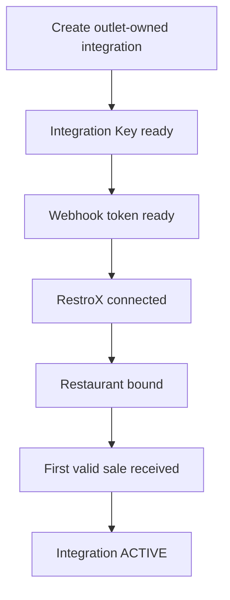

The merchant onboarding flow is outlet-specific.

## Required Inputs

Creation requires:

- `storeId`
- `outletId`

If the store has zero outlets, the merchant must create an outlet before connecting RestroX.

## Integration Lifecycle

- `CREATED` - integration exists and credentials are generated
- `CONNECTED` - RestroX bound a restaurant to the outlet
- `ACTIVE` - first valid sale has been received
- `DISCONNECTED` - merchant disconnected the outlet integration

## Derived Merchant Status

The merchant status builder exposes outlet-owned onboarding summaries such as:

- `CREATED`
- `CONNECTED`
- `READY`
- `DISCONNECTED`

`READY` is the merchant-facing summary for an integration whose lifecycle status is `ACTIVE`.

## Health Status

Health stays separate from lifecycle:

- `HEALTHY`
- `WARNING`
- `ERROR`

Restaurant binding mismatches move health to `ERROR`.
