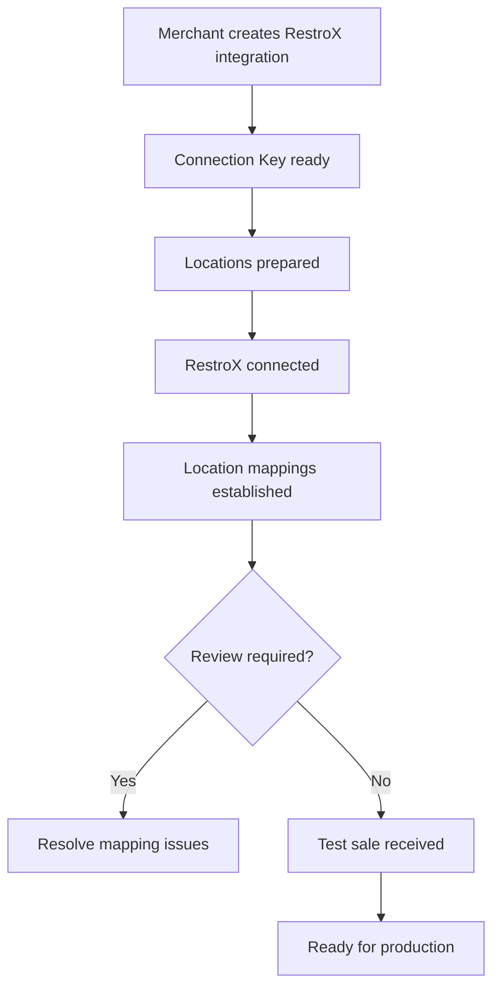

The native merchant onboarding flow uses Connection Keys, location preparation, RestroX connection, mapping validation, and test-sale verification to move a RestroX integration into a ready state.

## Purpose

Use this page to understand:

- how a merchant starts the integration
- how RestroX changes integration state
- how readiness is calculated

## Merchant Onboarding Flow



## Connection Flow

1. The merchant creates a RestroX integration in Samparka.
2. Samparka issues a Connection Key.
3. Samparka prepares location records.
4. RestroX connects through the native partner API.
5. RestroX syncs real restaurant IDs.
6. Samparka calculates readiness based on connection, valid mappings, and test-sale activity.

## Partner-Facing Onboarding Stages

Use these stage labels when describing onboarding progress:

1. Integration Key Ready
2. Locations Prepared
3. RestroX Connected
4. Location Mappings Established
5. Test Sale Received
6. Ready For Production

### Stage Definitions

`Locations Prepared`

Means Samparka has created location records.

`Location Mappings Established`

Means real RestroX restaurant IDs have been mapped.

## Readiness States

The overall status values returned by the health builder are:

- `AWAITING_CONNECTION` — integration created, RestroX has not connected yet
- `NOT_CONNECTED` — integration key was revoked; reconnect required
- `NEEDS_TESTING` — RestroX connected and locations resolved, no test sale received yet
- `READY` — RestroX connected and at least one `sale.completed` event received
- `REVIEW_REQUIRED` — connection completed but one or more locations need manual review

The constant `CONNECTED` exists in the codebase but is never returned by the health builder in the current implementation. Do not rely on it as a production state.

The merchant-facing labels for these states are:

- `Connecting` (AWAITING_CONNECTION)
- `Not Connected` (NOT_CONNECTED)
- `Needs Review` (REVIEW_REQUIRED)
- `Needs Testing` (NEEDS_TESTING)
- `Ready` (READY)

## Status Model

The verified onboarding stage values are:

- `not_started`
- `integration_key_created`
- `awaiting_connection`
- `connected`
- `awaiting_test_sale`
- `ready_for_production`
- `review_required`

The readiness model tracks connection, mapping validation, and first sale receipt. Refund verification is optional.

## Verification Process

Merchant verification is exposed through:

```http
POST /api/pos-integrations/{id}/verify
GET /api/pos-integrations/{id}/status
GET /api/pos-integrations/{id}/onboarding
```

These routes are merchant-authenticated and are not public partner APIs, but they define the readiness model that RestroX should expect Samparka to compute.

The verification output includes:

- `readyForProduction`
- current headline
- required checks
- optional checks
- `testSaleReceived`
- `lastTestSaleAt`
- `currentStep`
- support context

## Activation Flow

The current readiness and activation logic share the same mapping validation rules. The integration is treated as:

- awaiting connection before RestroX has connected
- review required when prepared locations still need valid mapping decisions
- needs testing when RestroX is connected, location mappings are established, and no test sale has been observed
- ready when RestroX is connected and at least one `sale.completed` event has been received and processed

**READY means:**
- The integration is connected
- At least one `sale.completed` event has been received and processed

**READY does not guarantee:**
- Loyalty points were awarded on any specific sale
- Loyalty configuration is complete and valid
- Every future sale will earn points

## Endpoints

### Partner Connect

```http
POST /api/partners/restrox/connect
```

### Partner Sync Locations

```http
POST /api/partners/restrox/sync-locations
```

### Partner Test Sale

```http
POST /api/partners/restrox/test-sale
```

### Merchant Status And Verification

```http
GET /api/pos-integrations/{id}/status
POST /api/pos-integrations/{id}/verify
GET /api/pos-integrations/{id}/onboarding
```

These merchant routes are documented here for lifecycle context only.

## Response Example

Example merchant status shape derived from the verified service:

```json
{
  "status": "NEEDS_TESTING",
  "statusLabel": "Needs Testing",
  "progressPercent": 75,
  "currentStep": "Location Mappings Established",
  "nextAction": {
    "key": "verify_connection",
    "label": "Verify Connection",
    "ctaLabel": "Verify Connection"
  },
  "testSaleReceived": false
}
```

## Failure States

### Needs Review

Occurs when:

- partner location sync produces review issues
- a real restaurant ID has not yet been mapped
- a synced location becomes stale
- a merchant transitions from store-level mapping to outlet-based mapping

### Not Connected

Occurs when:

- the integration key was revoked and the integration must be reconnected

### Needs Testing

Occurs when:

- RestroX is connected
- location mappings are established and in a usable state
- no sale event has been received yet

## Operational Notes

- The status calculator uses test-sale presence from internal sale events.
- Refund verification is optional in the current step model.
- Merchant activity timeline entries such as `restrox_connected`, `locations_prepared`, `location_mappings_established`, and `integration_key_rotated` are part of the readiness context.

## Store Structure Changes

If a merchant starts with no outlets and later adds outlets:

- existing store-level mappings are preserved
- the integration enters `Needs Review`
- restaurant IDs must be explicitly remapped to outlets
- no automatic outlet assignment occurs
- no automatic remapping occurs
- previously blocked events can be replayed after remapping

## Troubleshooting Notes

- If a merchant is stuck in `Needs Review`, inspect synced locations before testing sales.
- If a merchant is stuck in `Needs Testing`, confirm that the test-sale path is sending a valid sale payload.
- If a previously connected merchant appears `Not Connected`, confirm whether the Connection Key was rotated.

## Related Documentation

- [Connection Keys](./connection-keys)
- [Store Linking](./store-linking)
- [Partner API](./partner-api)
- [Readiness Checklist](./readiness-checklist)
