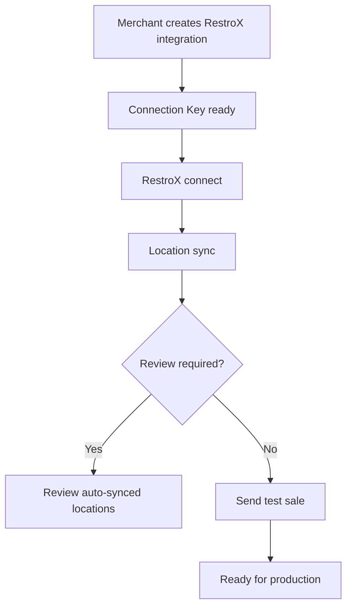

The native merchant onboarding flow uses Connection Keys, partner connect, location sync, and test-sale verification to move a RestroX integration into a ready state.

## Purpose

Use this page to understand:

- how a merchant starts the integration
- how RestroX changes integration state
- how readiness is calculated

## Merchant Onboarding Flow



## Connection Flow

1. The merchant creates a RestroX integration in Samparka.
2. Samparka issues a Connection Key.
3. RestroX connects through the native partner API.
4. RestroX syncs locations.
5. Samparka calculates readiness based on connection, location sync, and test-sale activity.

## Readiness States

The verified overall status values are:

- `NOT_CONNECTED`
- `AWAITING_CONNECTION`
- `CONNECTED`
- `NEEDS_TESTING`
- `READY`
- `REVIEW_REQUIRED`

The current merchant health builder returns these merchant-facing labels:

- `Not Connected`
- `Connecting`
- `Needs Review`
- `Needs Testing`
- `Ready`

Implementation detail requires clarification.

The `CONNECTED` overall status constant exists, but the verified health builder paths in this pass do not return it as a final externally surfaced state.

## Status Model

The verified onboarding stage values are:

- `not_started`
- `integration_key_created`
- `awaiting_connection`
- `connected`
- `awaiting_test_sale`
- `ready_for_production`
- `review_required`

The readiness model tracks connection, location sync, and first sale receipt. Refund verification is optional.

## Verification Process

Merchant verification is exposed through:

```http
POST /api/pos-integrations/{id}/verify
GET /api/pos-integrations/{id}/status
GET /api/pos-integrations/{id}/onboarding
```

These routes are merchant-authenticated and are not public partner APIs, but they define the readiness model that RestroX should expect Samparka to compute.

The verification output includes:

- `readyForProduction`
- current headline
- required checks
- optional checks
- `testSaleReceived`
- `lastTestSaleAt`
- `currentStep`
- support context

## Activation Flow

The current readiness logic treats the integration as:

- awaiting connection before RestroX has connected
- review required when synced locations need manual review
- needs testing when RestroX is connected and no test sale has been observed
- ready when RestroX is connected and at least one `sale.completed` event has been received and processed

**READY means:**
- The integration is connected
- At least one `sale.completed` event has been received and processed

**READY does not guarantee:**
- Loyalty points were awarded on any specific sale
- Loyalty configuration is complete and valid
- Every future sale will earn points

## Endpoints

### Partner Connect

```http
POST /api/partners/restrox/connect
```

### Partner Sync Locations

```http
POST /api/partners/restrox/sync-locations
```

### Partner Test Sale

```http
POST /api/partners/restrox/test-sale
```

### Merchant Status And Verification

```http
GET /api/pos-integrations/{id}/status
POST /api/pos-integrations/{id}/verify
GET /api/pos-integrations/{id}/onboarding
```

These merchant routes are documented here for lifecycle context only.

## Response Example

Example merchant status shape derived from the verified service:

```json
{
  "status": "NEEDS_TESTING",
  "statusLabel": "Needs Testing",
  "progressPercent": 75,
  "currentStep": "Send Test Sale",
  "nextAction": {
    "key": "verify_connection",
    "label": "Verify Connection",
    "ctaLabel": "Verify Connection"
  },
  "testSaleReceived": false
}
```

## Failure States

### Needs Review

Occurs when:

- partner location sync produces review issues
- an auto-synced location cannot be matched
- a synced location becomes stale

### Not Connected

Occurs when:

- the integration key was revoked and the integration must be reconnected

### Needs Testing

Occurs when:

- RestroX is connected
- locations are in a usable state
- no sale event has been received yet

## Operational Notes

- The status calculator uses test-sale presence from internal sale events.
- Refund verification is optional in the current step model.
- Merchant activity timeline entries such as `restrox_connected`, `locations_synced`, and `integration_key_rotated` are part of the readiness context.

## Troubleshooting Notes

- If a merchant is stuck in `Needs Review`, inspect synced locations before testing sales.
- If a merchant is stuck in `Needs Testing`, confirm that the test-sale path is sending a valid sale payload.
- If a previously connected merchant appears `Not Connected`, confirm whether the Connection Key was rotated.

## Related Documentation

- [Connection Keys](./connection-keys)
- [Store Linking](./store-linking)
- [Partner API](./partner-api)
- [Readiness Checklist](./readiness-checklist)
