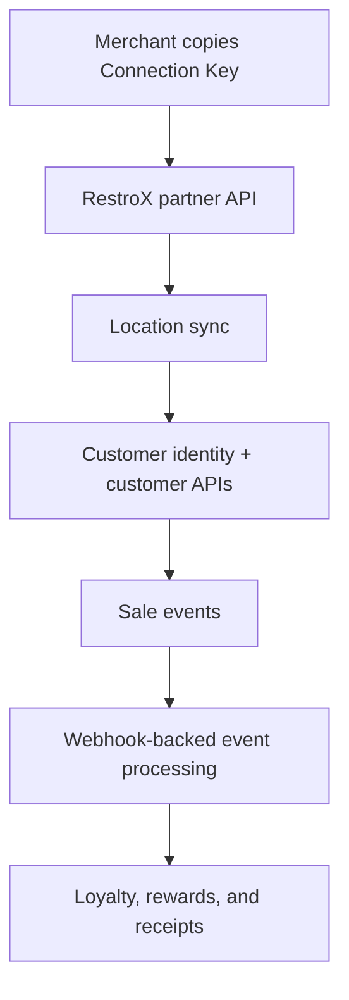

RestroX can connect to Samparka through a native onboarding flow that works alongside the supported webhook delivery model.

The native flow is designed for partner engineers who need to:

- connect a merchant using a Connection Key
- sync locations automatically
- retrieve customers consistently
- send sale events into Samparka's loyalty processing pipeline

## What This Package Covers

This package documents externally supported integration behavior for:

- RestroX engineers
- partner integrators
- technical implementation teams

It does not document internal Samparka admin tooling, internal reconciliation workflows, or internal support operations.

## Native vs Webhook

The native integration uses partner APIs for onboarding and customer operations, while webhook delivery remains the event transport layer.

## Start With

<Columns cols={2}>
  <Card title="Architecture" icon="blocks" href="/integrations/restrox/native/architecture">
    Understand the system boundaries, data flow, and how native APIs layer on top of webhook processing.
  </Card>
  <Card title="Authentication" icon="shield" href="/integrations/restrox/native/authentication">
    Review the credentials and headers used by partner APIs, merchant APIs, and webhook delivery.
  </Card>
  <Card title="Connection Keys" icon="key-round" href="/integrations/restrox/native/connection-keys">
    Learn how Samparka issues, validates, and rotates merchant-facing Connection Keys.
  </Card>
  <Card title="Merchant Onboarding" icon="list-checks" href="/integrations/restrox/native/merchant-onboarding">
    Follow the partner-facing onboarding flow from key handoff through readiness verification.
  </Card>
  <Card title="Customer Identity" icon="users" href="/integrations/restrox/native/customer-identity">
    Understand the normalized phone strategy and the outcomes used by customer resolution.
  </Card>
  <Card title="Partner API" icon="plug-zap" href="/integrations/restrox/native/partner-api">
    Implement the connect, sync, and test-sale APIs exposed to RestroX.
  </Card>
</Columns>

## Recommended Reading Order

<Steps>
  <Step title="Read Architecture">
    Start with the architecture page so the partner APIs, customer APIs, and webhook delivery model fit into one mental model.
  </Step>
  <Step title="Confirm Environments And Auth">
    Review environments and authentication before wiring any requests into RestroX services.
  </Step>
  <Step title="Implement Connection And Sync">
    Use the Connection Keys, Merchant Onboarding, Store Linking, and Partner API pages to connect the merchant and sync locations.
  </Step>
  <Step title="Implement Customer Resolution">
    Use Customer Identity and Customer API to make customer lookup and retrieval behavior deterministic.
  </Step>
  <Step title="Implement Cashier Workflow">
    Use Customer Loyalty Award Flow to keep customer association, optional enrollment, and checkout behavior consistent across RestroX implementations.
  </Step>
  <Step title="Validate Events And Readiness">
    Use Loyalty Processing, Testing Guide, and Readiness Checklist to confirm the integration is ready for production.
  </Step>
</Steps>

## Related Documentation

- [Architecture](./architecture)
- [Environments](./environments)
- [Connection Keys](./connection-keys)
- [Merchant Onboarding](./merchant-onboarding)
- [Store Linking](./store-linking)
- [Customer Loyalty Award Flow](./customer-loyalty-award-flow)
- [Customer API](./customer-api)
- [Webhook Endpoint](../webhook-endpoint)
