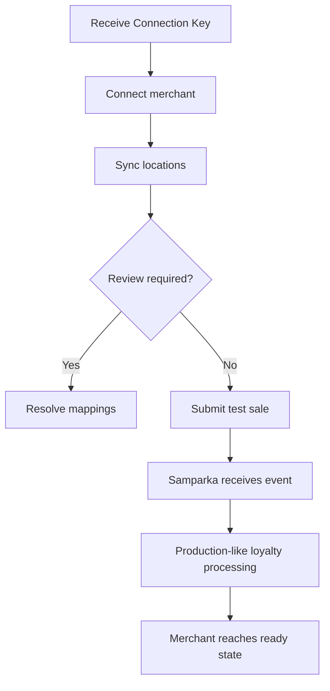

Samparka exposes a small RestroX partner API for native onboarding and readiness verification.

## Purpose

Use this page to implement:

- merchant connect
- location sync
- test sale submission

## Concepts

All partner routes:

- are authenticated with a partner key
- are scoped to provider `restrox`
- use the merchant Connection Key to resolve the target integration

## Provider Integration Flow



## Authentication

Accepted credentials:

- `x-partner-key`
- `Authorization: Bearer {partnerKey}`

See [Authentication](./authentication) for the full matrix.

## Endpoints

### Connect Merchant

```http
POST /api/partners/restrox/connect
Content-Type: application/json
```

Example request:

```json
{
  "integrationKey": "SPK-RX-ABC12345",
  "account": {
    "id": "restrox-account-001",
    "name": "Java Express"
  },
  "locations": [
    {
      "externalLocationId": "ktm-branch-01",
      "externalLocationName": "Kathmandu Branch"
    }
  ]
}
```

Example response:

```json
{
  "success": true,
  "message": "RestroX connected",
  "data": {
    "syncedCount": 1,
    "reviewIssues": [],
    "reviewRequired": false,
    "partnerConnectionStatus": "connected"
  }
}
```

Verified behavior:

- resolves the integration by `integrationKey`
- loads store outlets from the linked store
- persists the synced location records
- marks partner connection metadata and sync timestamps
- returns sync results in the shared success envelope

### Sync Locations

```http
POST /api/partners/restrox/sync-locations
Content-Type: application/json
```

Example request:

```json
{
  "integrationKey": "SPK-RX-ABC12345",
  "account": {
    "id": "restrox-account-001",
    "name": "Java Express"
  },
  "locations": [
    {
      "externalLocationId": "ktm-branch-01",
      "externalLocationName": "Kathmandu Branch",
      "outletId": "685000000000000000000001"
    }
  ]
}
```

Example response:

```json
{
  "success": true,
  "message": "Locations synchronized",
  "data": {
    "syncedCount": 1,
    "reviewIssues": [],
    "reviewRequired": false,
    "partnerConnectionStatus": "connected"
  }
}
```

Verified behavior:

- resolves the integration by `integrationKey`
- uses provider-facing location fields such as `externalLocationId` and `externalLocationName`
- attempts outlet matching by outlet hint or normalized name
- records review issues when a location is missing an external ID, is duplicated, is ambiguous, or cannot be matched
- updates sync timestamps and partner metadata

### Test Sale

```http
POST /api/partners/restrox/test-sale
Content-Type: application/json
```

Example request:

```json
{
  "integrationKey": "SPK-RX-ABC12345",
  "locationId": "ktm-branch-01",
  "payload": {
    "event_type": "order.completed",
    "order_id": "restrox-sale-1001",
    "created_at": "2026-06-08T10:15:00.000Z",
    "amount": 850,
    "currency": "NPR",
    "customer": { "phone": "9801234567" },
    "external_location_id": "ktm-branch-01",
    "external_location_name": "Kathmandu Branch",
    "items": [{ "name": "Cappuccino", "qty": 1, "price": 850 }]
  }
}
```

Example response:

```json
{
  "success": true,
  "message": "Test sale submitted",
  "data": {
    "success": true,
    "message": "Event received"
  }
}
```

Request rules:

- `locationId` is preferred when you already know the RestroX location identifier
- `locationId` is interpreted as the provider-facing `external_location_id`
- `locationId` must be the RestroX external location identifier, not a Samparka internal identifier
- the payload may still supply the location identifier through:
  - `external_location_id`
  - `location_id`
  - `outlet_id`
  - `branch_id`

Verified `test-sale` flow:

1. resolve integration using `integrationKey`
2. determine the requested location identifier from `locationId` or payload aliases
3. reject conflicting top-level and payload identifiers
4. resolve the mapped location by integration plus `external_location_id`
5. require a valid mapped location with webhook delivery enabled
6. submit the test event through the same downstream loyalty processing behavior used by production webhook traffic

Verified behavior:

- updates `integration_key_last_used_at` after the test event is submitted successfully

## Expected Responses

All three public partner routes use the shared success wrapper:

```json
{
  "success": true,
  "message": "Human-readable message",
  "data": {}
}
```

Failures use:

```json
{
  "success": false,
  "message": "Human-readable error"
}
```

## Error Conditions

Verified partner-visible failures include:

- `401 Unauthorized partner request`
- `404 Invalid Integration Key`
- `400 locationId does not match the payload location identifier`
- `400 A location identifier is required. Provide locationId or a payload location field.`
- `404 No mapped RestroX location found for the provided location identifier`
- `409 Ambiguous RestroX location identifier for this integration`
- `409 The selected RestroX location does not have a webhook token`
- `409 The selected RestroX location does not have a mapped external location ID`
- event validation failures such as:
  - `400 Request body must be a JSON object`
  - `400 Missing event_type in payload`

## Readiness Requirements

The current onboarding model treats readiness as:

- Connection Key created
- RestroX connected
- locations synced without unresolved review state
- test sale accepted through the supported loyalty processing path

Refund verification is optional in the current merchant checklist model.

## Production Recommendations

- connect the merchant before sending any production events
- sync locations before relying on sale traffic
- verify customer lookup behavior before go-live
- use the native test-sale path to validate the same downstream loyalty processing behavior used by production webhook traffic

## Identity Outcomes In Partner Flow

Customer identity outcomes matter during end-to-end verification:

- `found`: customer can be reused directly
- `missing`: customer is not currently available through the read-only partner customer APIs
- `conflict`: manual resolution is required
- `invalid_phone`: correct the input before customer calls or loyalty expectations

## Operational Notes

- The public partner routes do not expose a disconnect API in the verified implementation.
- The current implementation does not publish a separate account ownership lock for repeated connect calls.

Implementation detail requires clarification.

## Troubleshooting Notes

- If `connect` returns `reviewRequired: true`, inspect the review issues before testing sales.
- If `test-sale` succeeds at transport level but readiness does not advance, verify location sync, location state, and customer identity assumptions.
- If the same connection must be re-established after key rotation, use the new Connection Key rather than retrying the old one.

## Related Documentation

- [Connection Keys](./connection-keys)
- [Store Linking](./store-linking)
- [Customer Identity](./customer-identity)
- [Customer API](./customer-api)
- [Loyalty Processing](./loyalty-processing)
