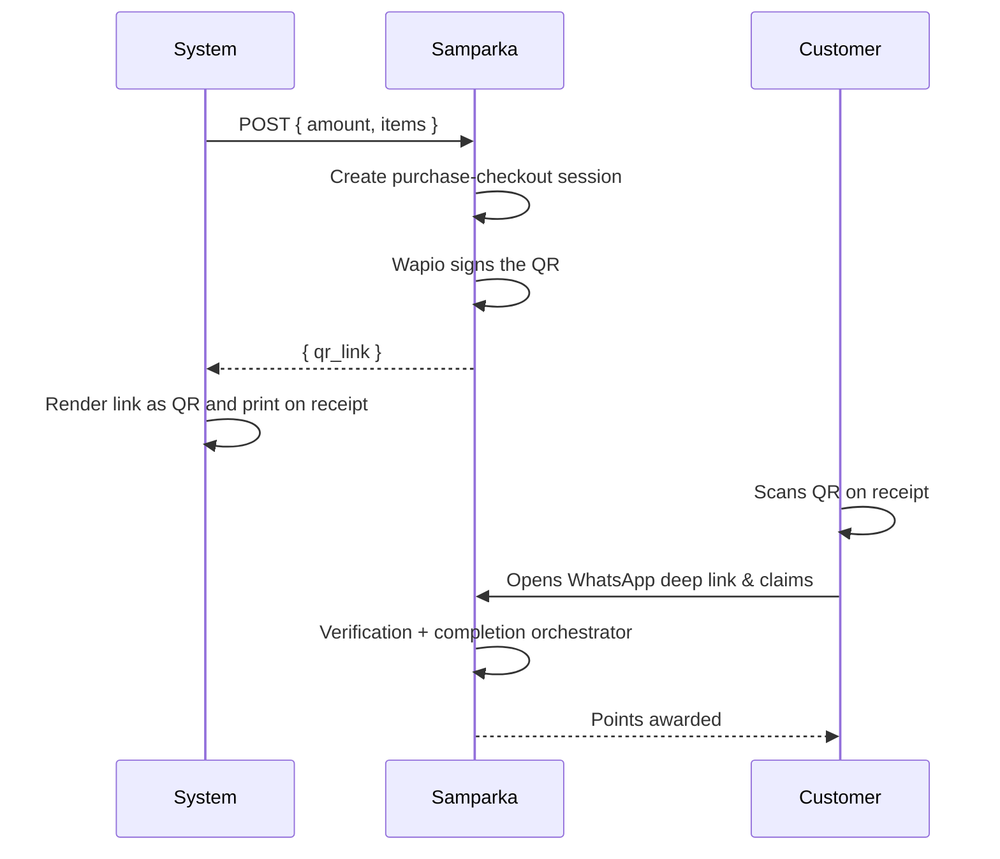
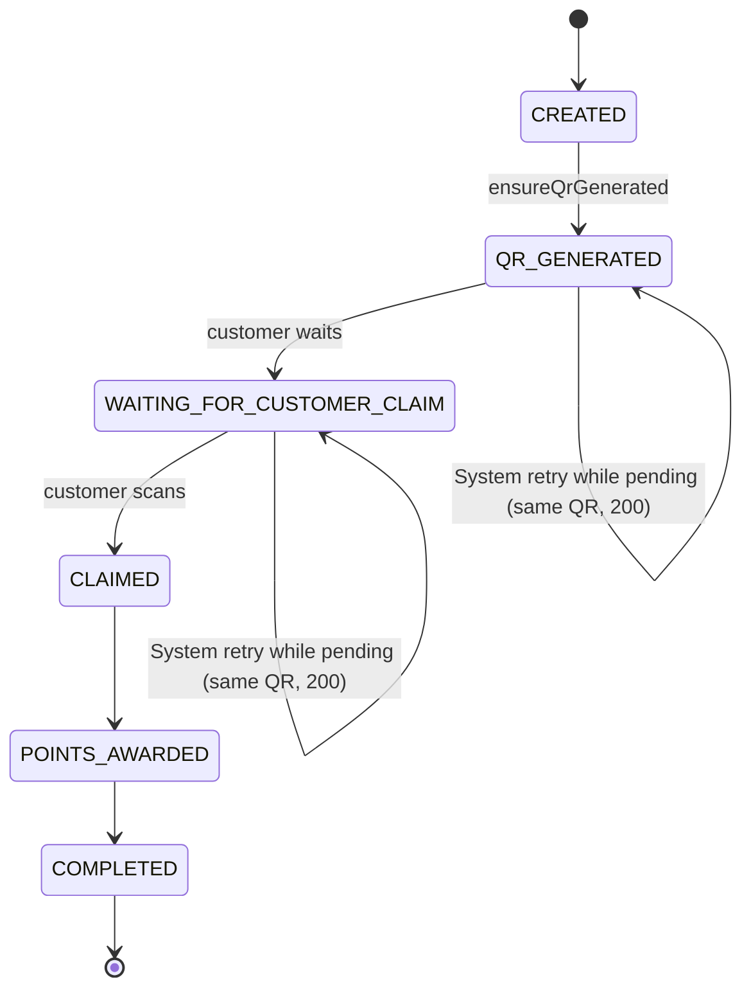
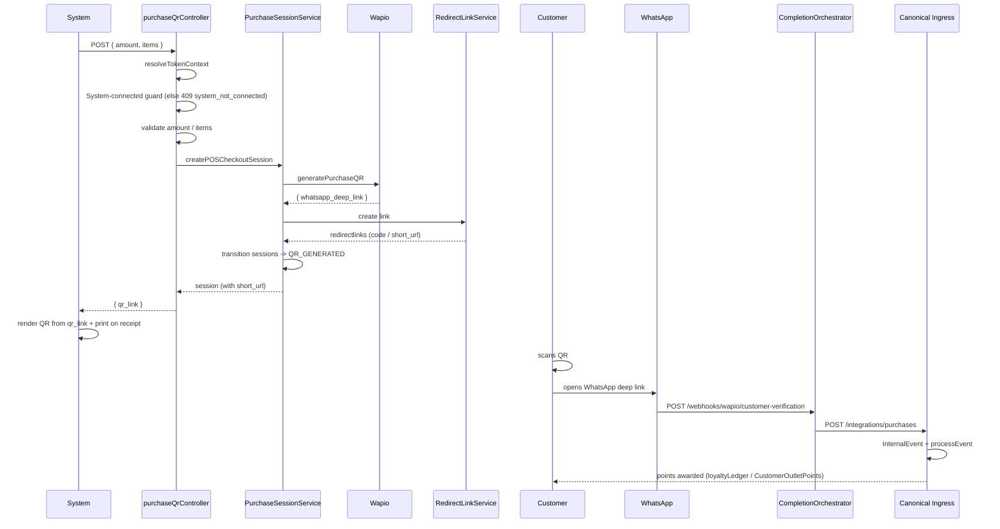

import { Tabs, Tab } from "@mintlify/components";

<Tabs>
  <Tab title="App">
    <Info>
      The **Communication** feature requires a connected WhatsApp communication provider. To use this feature and get access, contact the Samparka team.
    </Info>

The Purchase QR endpoint lets **System terminals** create a Samparka *purchase-checkout* session on the fly and receive the QR link in the same HTTP response. The System renders that link as a QR and prints it on its receipt. The customer scans → WhatsApp flow → Wapio verification → points. The endpoint reuses 100% of the existing purchase-checkout pipeline — no new models, no new loyalty logic, no new QR infrastructure.

<Info>
  The **Communication** feature requires a connected WhatsApp communication provider. To use this feature and get access, contact the Samparka team.
</Info>



## Why this endpoint and not the existing alternatives

| Existing path | What it does | Why not enough |
|---|---|---|
| Dashboard checkout (`POST /api/v1/purchase-sessions`) | Staff manually types amount → QR on screen | Requires Samparka dashboard; System cashiers never open it |
| System webhooks (`POST /integrations/system/:provider/events`) | System pushes `sale.completed` → direct points, no QR | Gives no QR to print |
| Canonical ingress (`POST /api/v1/integrations/purchases`) | Purchase sessions push *completed* purchases into the canonical `InternalEvent` pipeline | That's the sink after completion, not the source that creates QR sessions |

The new route is the **missing source**: System *creates* the QR session instead of staff.

## Architecture at a glance

```mermaid
flowchart LR
  subgraph SYSTEM_SIDE[System Terminal]
    System[System / fetch cashier]
  end
  subgraph SAM_SIDE[Samparka]
    CTL[purchaseQrController]
    LS[Location Resolution<br/>locationResolutionService]
    PG[System-connected guard<br/>CONNECTED / ACTIVE]
    ID[Idempotency<br/>ps_... (per-request fresh)]
    WAP[QR generation via Wapio<br/>+ redirect short_url]
  end

  System -->|POST /integrations/system/:provider/purchase-qr<br/>{ amount, currency, items }| CTL
  CTL --> LS
  LS --> PG
  PG --> ID
  ID --> WAP
  WAP -. { qr_link, purchase_reference, ... } .-> System
  PG -.->|else 409 system_not_connected| System
```

## State and lifecycle



Statuses that still return the same QR (retry-safe): `QR_GENERATED`, `WAITING_FOR_CUSTOMER_CLAIM`. Terminal/expired ones return `409`/`410`.

## End-to-end sequence (including the customer scan)



## Future considerations (optional)

* Rate-limit the new route the same way `system/routes.js` notes `Rate-limiting placeholder`.
* If System vendors need CORS/origin lockdown, add it on this path.
* If analytics/missions should ever *consume* System-QR-origin sessions, register those processors (today they're no-ops, so no work is left for them).

## Related Documentation

- [Request / Response Contract](./request-response)
- [Integration Guide](./integration-guide)
- [Testing & Verification](./testing)
- [Customer Loyalty Award Flow](../customer-loyalty-award-flow)
- [Customer Identity](../customer-identity)
  </Tab>
  <Tab title="Communication">
    <Info>
      The **Communication** feature requires a connected WhatsApp communication provider. To use this feature and get access, contact the Samparka team.
    </Info>

The Purchase QR endpoint lets **System terminals** create a Samparka *purchase-checkout* session on the fly and receive the QR link in the same HTTP response. The System renders that link as a QR and prints it on its receipt. The customer scans → WhatsApp flow → Wapio verification → points. The endpoint reuses 100% of the existing purchase-checkout pipeline — no new models, no new loyalty logic, no new QR infrastructure.

## Related Documentation

- [Request / Response Contract](./request-response)
- [Integration Guide](./integration-guide)
- [Testing & Verification](./testing)
- [Customer Loyalty Award Flow](../customer-loyalty-award-flow)
- [Customer Identity](../customer-identity)
  </Tab>
</Tabs>
